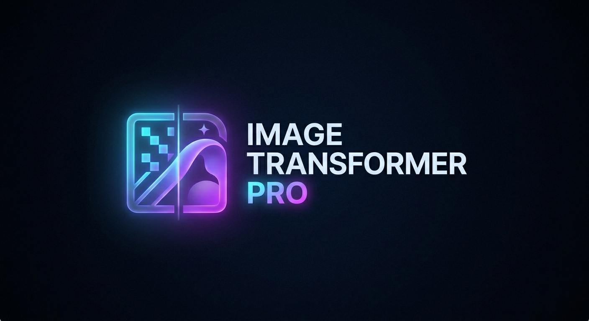

# Image Transformer Pro (Luminous Lens)



## 🌟 Overview
**Image Transformer Pro** is a high-performance, real-time image editing suite designed for professional workflows. Built with a "Neon Horizon" aesthetic, it combines a React-based fluid frontend with a powerful FastAPI/OpenCV backend to deliver seamless image manipulation directly in your browser.

Whether you're performing basic adjustments or complex signal processing filters, Luminous Lens provides the precision and speed required for modern creative tasks.

---

## 🚀 Features

### 🛠 Studio Engine (Editing Tools)
- **Transform**: 
  - Smooth **Rotation** with sub-degree precision.
  - **Flip** operations (Horizontal, Vertical, Both).
  - High-fidelity **Resizing**.
- **Adjust**:
  - Real-time **Brightness** and **Contrast** mapping.
  - Instant **Grayscale** conversion.
- **Filters**:
  - **Gaussian Blur** with variable kernel size.
  - **Sharpen Intensity** for crisp detail recovery.
  - Advanced Edge Detection: **Sobel** and **Canny** operators.
- **Interactive Crop**:
  - Draw custom cropping boundaries directly on the canvas using the **Interactive Select Box**.

### 🎨 Visual & UX Excellence
- **Infinite Zoom & Pan**: Scroll to zoom (0.1x to 5.0x) and drag to pan across high-resolution canvases.
- **Dynamic Comparison**: Side-by-side "Before/After" slider with direct mouse-tracking DIVider.
- **Operation History**: 
  - Full **Undo/Redo** support.
  - **Evolution Matrix**: A visual log of all changes allowing you to "Time Travel" back to any specific state.
- **Metadata Inspector**: Analyze file weight, resolution, and format at a glance.
- **Custom Export**: Name your masterpiece before exporting to standard web formats.

---

## 🛠 Tech Stack

### Frontend
- **Framework**: [React](https://reactjs.org/) + [Vite](https://vitejs.dev/)
- **Styling**: [Tailwind CSS](https://tailwindcss.com/)
- **State Management**: [Zustand](https://github.com/pmndrs/zustand)
- **Interactions**: [Lucide React](https://lucide.dev/), [React Image Crop](https://github.com/DominicTobias/react-image-crop)
- **Networking**: [Axios](https://axios-http.com/)

### Backend
- **API Framework**: [FastAPI](https://fastapi.tiangolo.com/) (Python)
- **Image Processing**: [OpenCV (cv2)](https://opencv.org/)
- **Data Handling**: [NumPy](https://numpy.org/), [Pillow (PIL)](https://python-pillow.org/)

### Infrastructure
- **Containerization**: [Docker](https://www.docker.com/) & [Docker Compose](https://docs.docker.com/compose/)

---

## 🏗 Getting Started

### Prerequisites
- [Docker](https://www.docker.com/get-started)
- [Docker Compose](https://docs.docker.com/compose/install/)

### Installation & Launch

1. **Clone the repository**:
   ```bash
   git clone https://github.com/your-username/image-transformer-pro.git
   cd image-transformer-pro
   ```

2. **Spin up the environment**:
   ```bash
   docker-compose up --build
   ```

3. **Access the application**:
   - **Frontend**: [http://localhost:5173](http://localhost:5173)
   - **Backend API**: [http://localhost:8000](http://localhost:8000)

---

## 📖 Usage Guide

1. **Upload**: Drag and drop an image onto the central Cyber-Grid or click to select a file.
2. **Manipulate**: Open any accordion panel on the left (Transform, Adjust, etc.) and tweak the parameters.
3. **Compare**: Click "Compare Original" at the bottom to toggle the sliding comparison view.
4. **Iterate**: Use the floating Undo/Redo buttons or the History modal to manage your editing path.
5. **Finalize**: Hit "Export" in the top bar, name your file, and save your work!

---

## 📜 License
This project is licensed under the MIT License - see the LICENSE file for details.

Developed with 💜 for the Creative Community.
